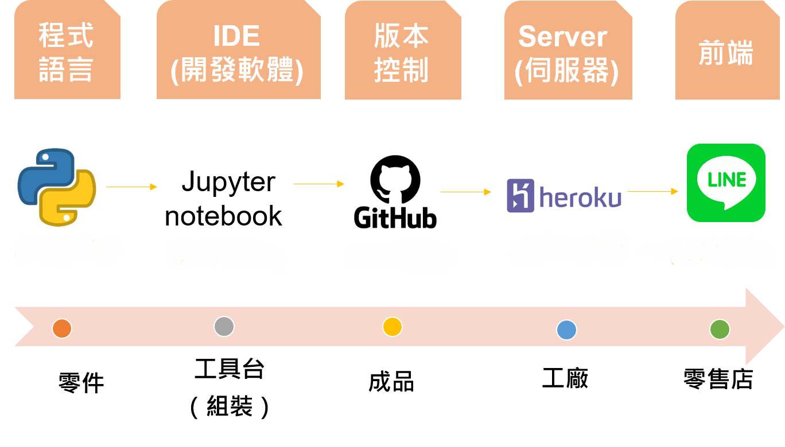
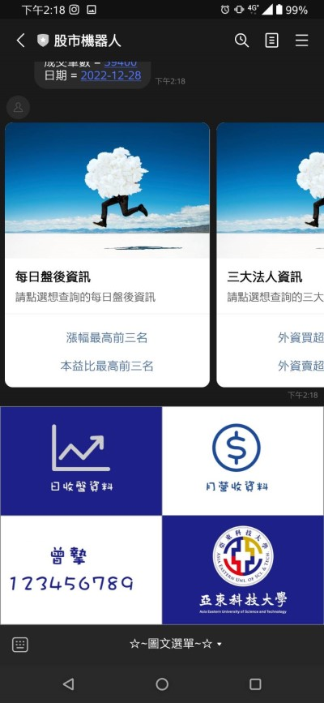

# StockLineBot
*股市LINE機器人*
## 介紹:
你是否也會覺得A網站的財報資料完整，又覺得B網站的選股條件完善，有時身邊又沒有好用的工具可以查詢的呢?
與其求助於人，不如自己動手做最好，我們該主題的主角「LINE Bot」就相當適合。

## 軟體:
  1. Python-jupyter
  2. LINE developer
  3. GitHub
  4. Heroku

## 功能:
  1. 連結學校的官網
  2. 查詢股市資料與財報資料

## 開發流程

## QR Code

## QR Code

